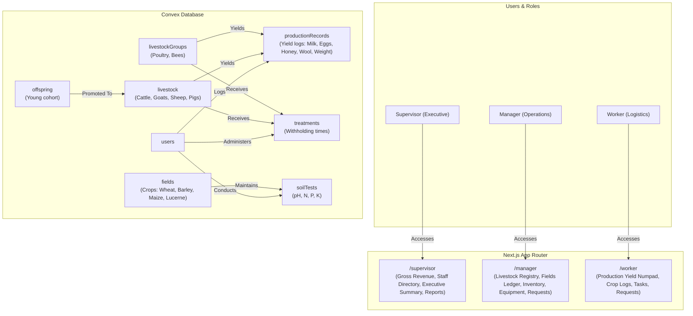
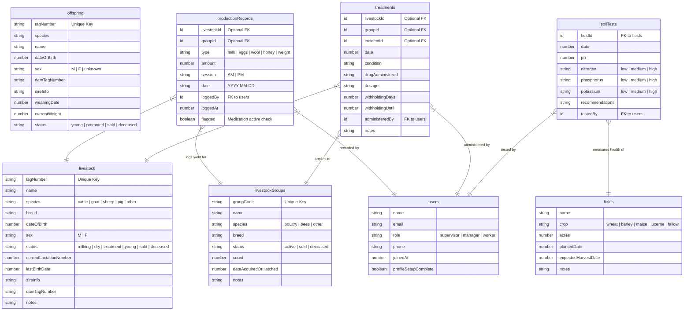

# Elfam Mixed Agribusiness Farm Management System
## System Architecture & Data Directory

Elfam is a generalized, multi-species Mixed Agribusiness Farm Management System engineered to support cattle, goats, sheep, pigs, poultry, and bees, alongside crop fields and soil health ledgers. The platform features strict Role-Based Access Control (RBAC) and real-time database safeguards like medication withholding flags.

---

## 1. System Topology & Data Flows

The following diagram illustrates the relationship between components, database tables, and the role-based routing layout.



---

## 2. Entity-Relationship Diagram (ERD)

The following schema maps the database structures defined in [schema.ts](file:///c:/Users/roych/Downloads/Elfam/convex/schema.ts).



---

## 3. Operational Safeguard: Withholding Logic

When production yields (e.g. Milk, Eggs, Honey) are logged, Elfam automatically cross-references the active treatments for that animal or group. If `Date.now() < withholdingUntil`, the production record is flagged as withheld to prevent contaminated products from entering the commercial bulk tank.

```
+-------------------------------------------------------+
|  Log Production Record Mutation                       |
+-------------------------------------------------------+
                           |
                           v
          Is there an active treatment where            
            withholdingUntil > current_time?            
             /                            \             
           YES                            NO            
           /                                \           
          v                                  v          
+--------------------+              +------------------+
| Flag record as     |              | Save record as   |
| WITHHELD (True)    |              | safe (Flagged=F) |
+--------------------+              +------------------+
          |                                  |
          v                                  v
Warning shown in UI:                Yield committed to  
"Output withheld!                   bulk ledger.        
Do not add to commercial stock."
```
